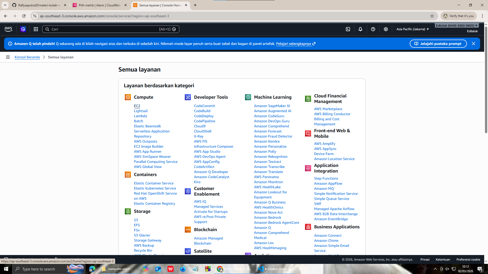
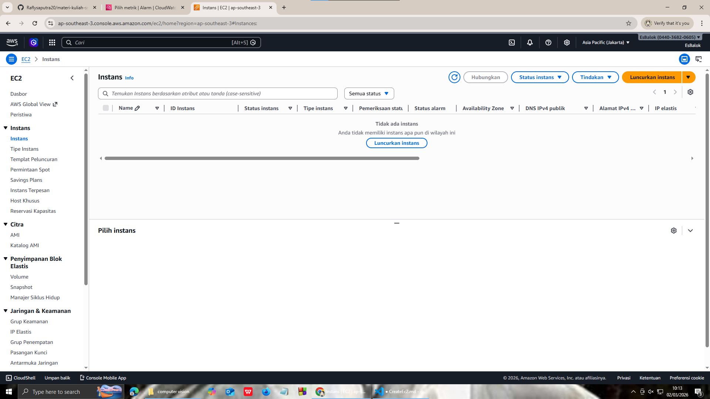
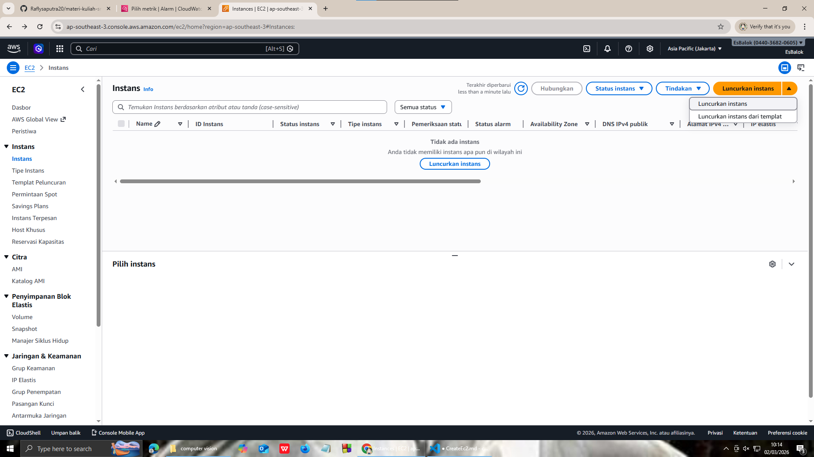
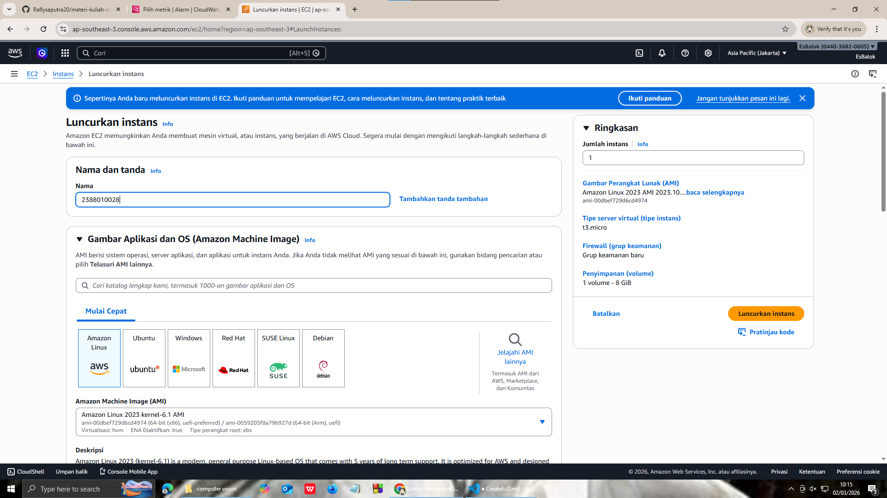
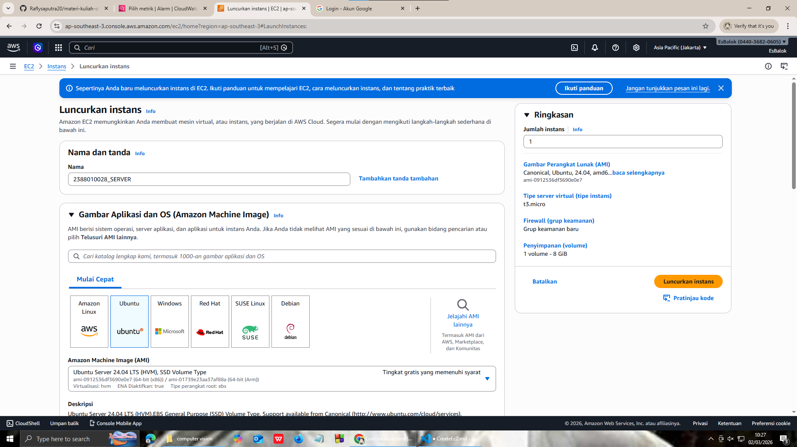
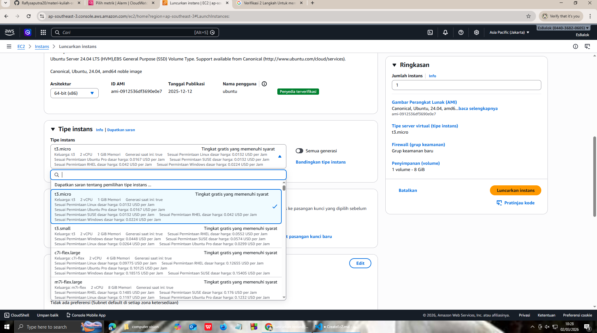
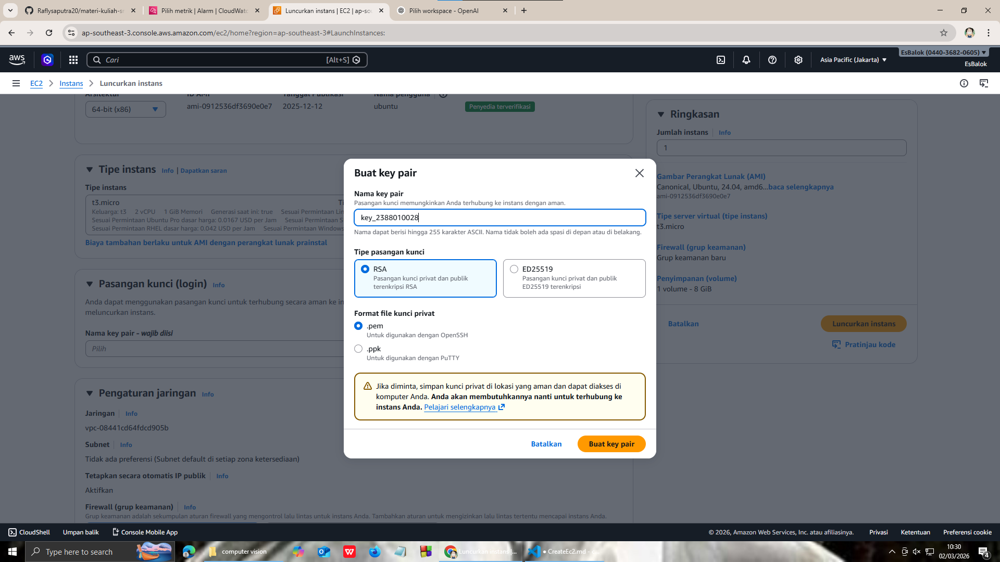
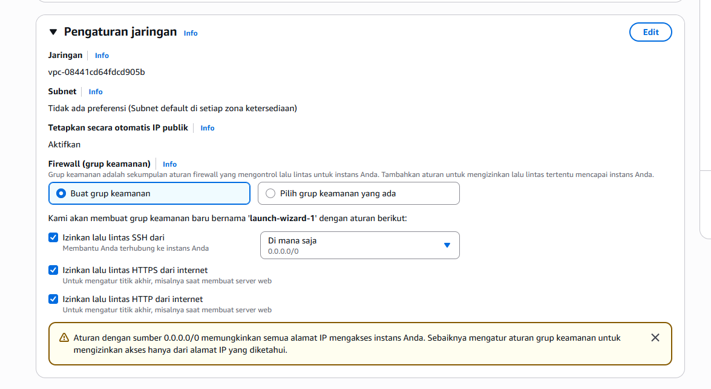
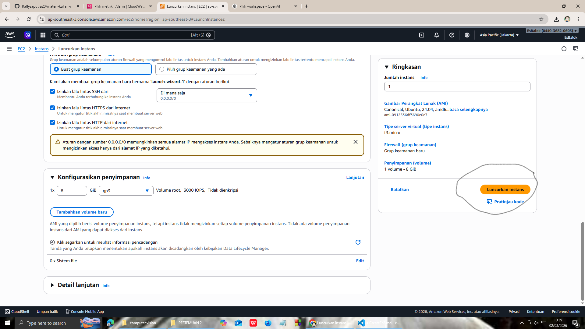
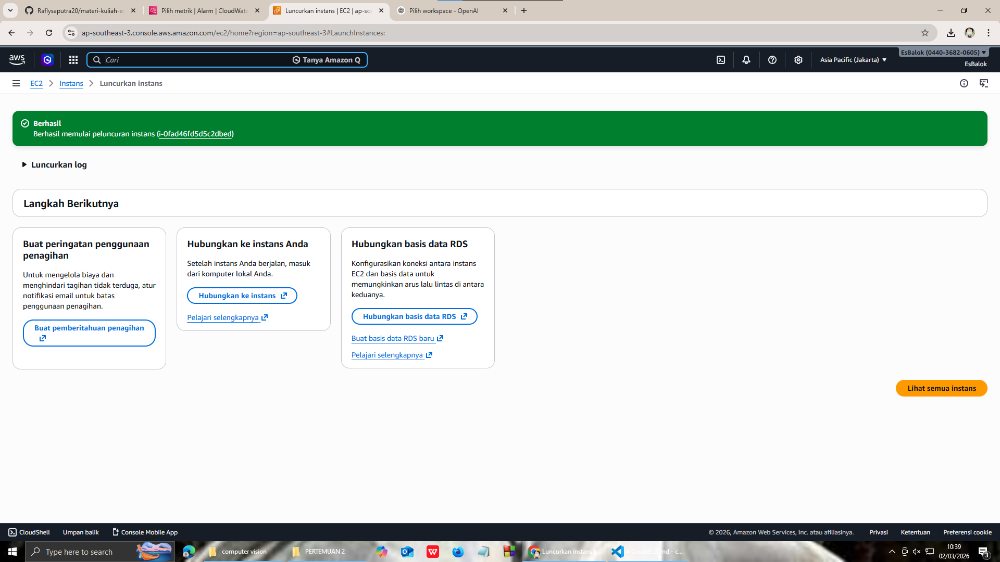

<<<<<<< HEAD
# membuat ec2 / instance / vm

1. pilih menu all services lalu cari ec2

2. di dalam menu EC2 kita pilih instance

3. di dalam instance kita pilih launc instance

4. Beri nama Instance kita dengan format (NIM MASING MASING)2388010028

5. kita pilih os sever untuk iinstance (ubuntu)

6. pilih resource t3.micro

7. membuat key pair, pilih new key pair, isi nama key, pilih rsa, format file.pem, create key pair

8. kemudian setting kepijakan keamanan / security -> Allow SSH = artinya membolehkan remote SSH dari luar -> Allow HTTPS = artinya instance bisa di akses dari protocol HTTPS -> ALLOW HTTP = Instance bisa di akses dari protocol HTTP

9. Selesai itu pencet launc instance

10. pastikan launch instance nya sukses

=======
# membuat ec2 / instance / vm

1. pilih menu all services lalu cari ec2

2. di dalam menu EC2 kita pilih instance

3. di dalam instance kita pilih launc instance

4. Beri nama Instance kita dengan format (NIM MASING MASING)2388010028

5. kita pilih os sever untuk iinstance (ubuntu)

6. pilih resource t3.micro

7. membuat key pair, pilih new key pair, isi nama key, pilih rsa, format file.pem, create key pair

8. kemudian setting kepijakan keamanan / security
   -> Allow SSH = artinya membolehkan remote SSH dari luar
   -> Allow HTTPS = artinya instance bisa di akses dari protocol HTTPS
   -> ALLOW HTTP = Instance bisa di akses dari protocol HTTP

9. Selesai itu pencet launc instance

10. pastikan launch instance nya sukses

>>>>>>> b865245fa88d7681ff4dd8a854cfea4dee19a523
