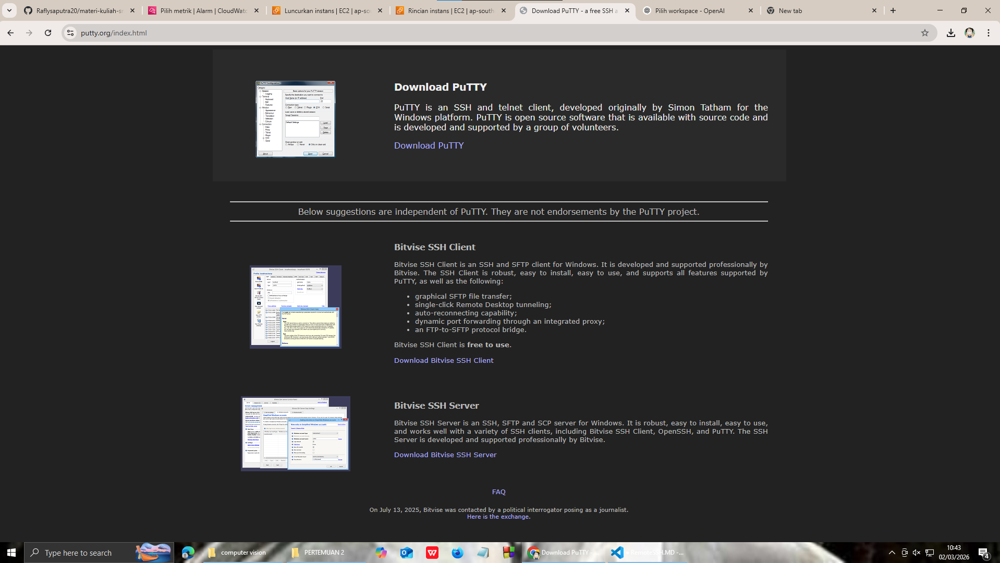
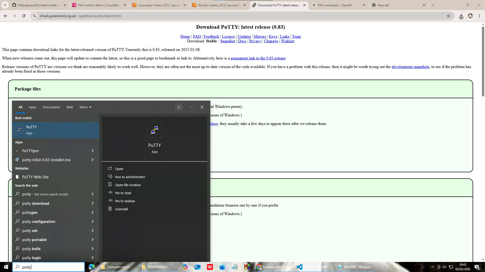
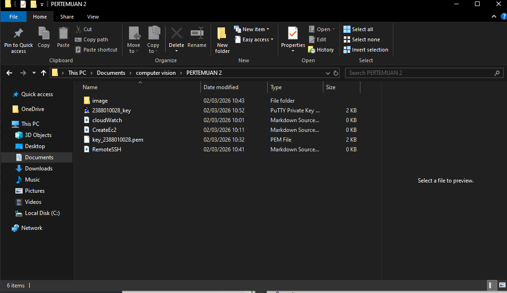
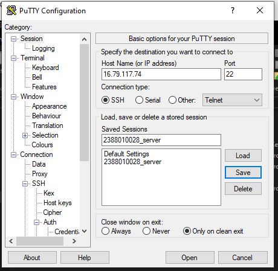
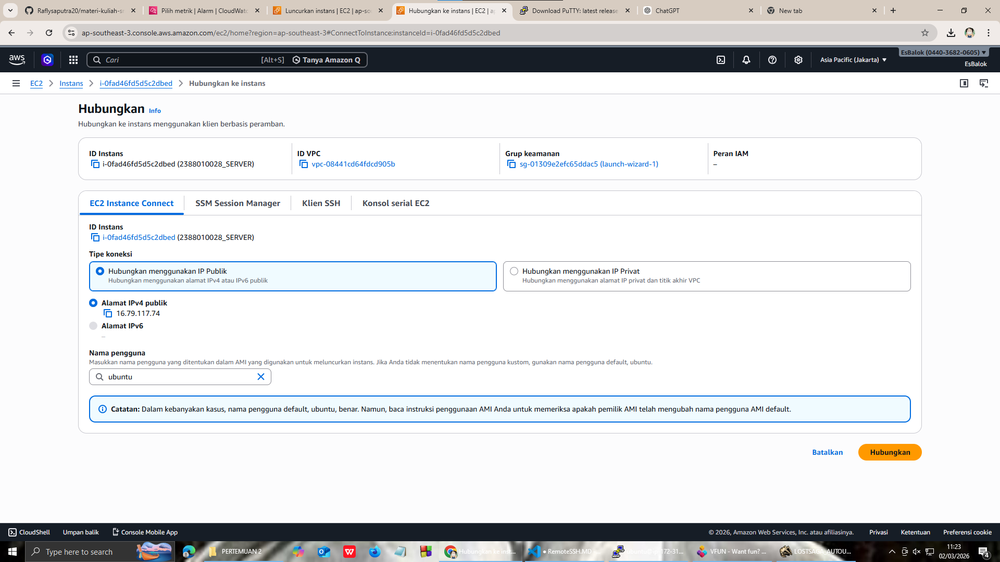
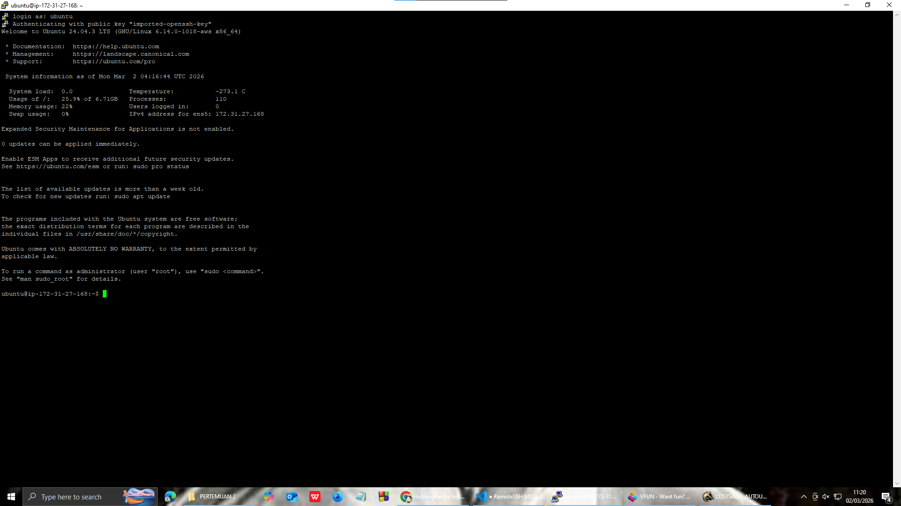
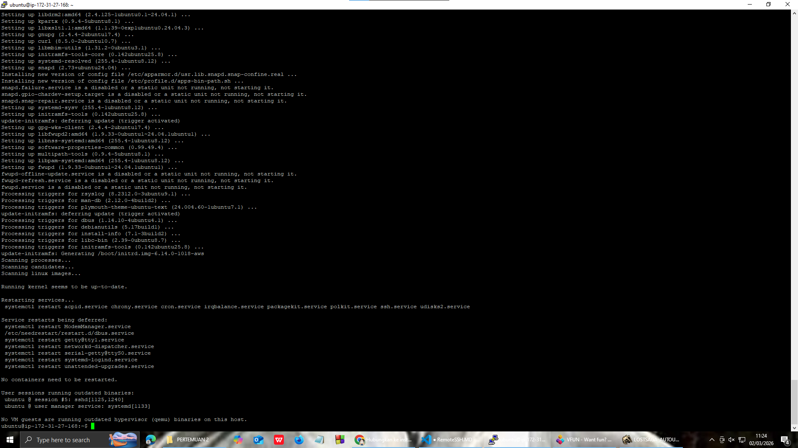
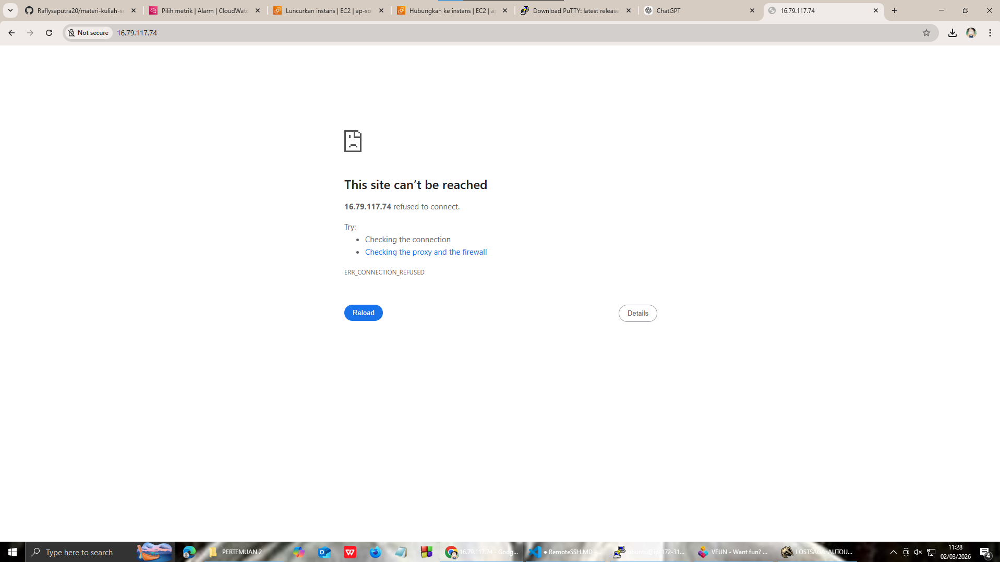
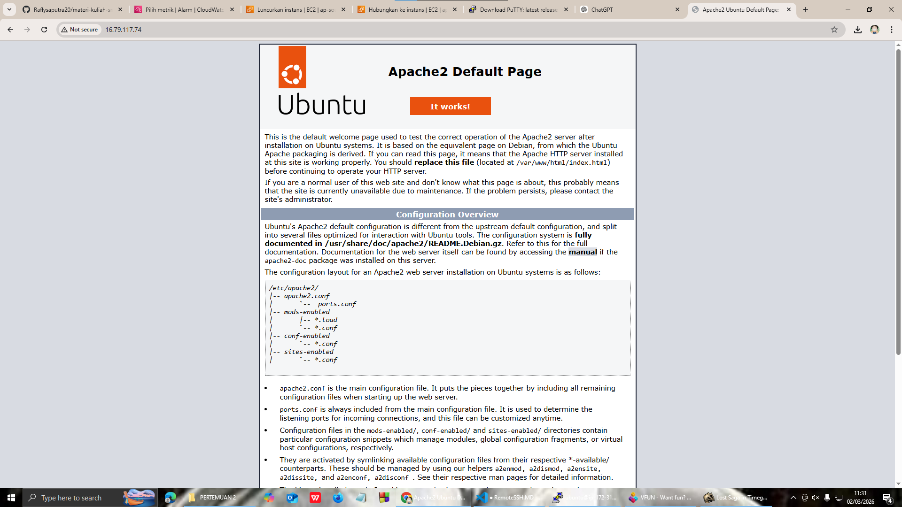
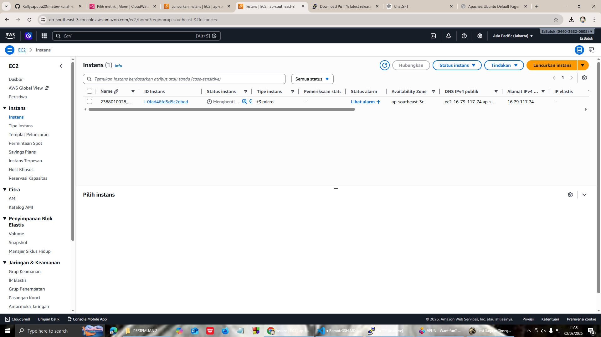

<<<<<<< HEAD
# REMOTE INSTANCE

1. download putty
   

2. convert file public key daro .pem menjadi .ppk di putty
   > buka putty gen load file save as .ppk
   >

3. Set up putty untuk remote ssh

   > buka apps putty isi ip public isi port SSH load file.ppl (klik -> SSH -> AUTH -> CREDENTIAL -> upload .ppk kita) lalu kembali ke dalam session LALU SAVE klik open masukan username sesuai instance
   >

   
   
   
4. sudo apt-get update sudo apt-get upgrade jika ada versi baru 
5. pembuktian remote ssh secara visual

   > copy public ip address instance paste ke browser  install web server seperti apache/nginx sudo apt install ketika sudah install reload browser nya 
   >
6. matikan instance agar tidak kena tagihan

   > sudo shutdown now
   >

=======
# REMOTE INSTANCE

1. download putty

   

2. convert file public key daro .pem menjadi .ppk di putty
   > buka putty gen
   > load file
   > save as .ppk
   >

3. Set up putty untuk remote ssh

   > buka apps putty
   > isi ip public
   > isi port SSH
   > load file.ppl (klik -> SSH -> AUTH -> CREDENTIAL -> upload .ppk kita)
   > lalu kembali ke dalam session LALU SAVE
   > klik open
   > masukan username sesuai instance
   >

   

   

   
4. sudo apt-get update
   sudo apt-get upgrade jika ada versi baru
   
5. pembuktian remote ssh secara visual

   > copy public ip address instance paste ke browser
   > 
   > install web server seperti apache/nginx
   > sudo apt install
   > ketika sudah install reload browser nya
   > 
   >
6. matikan instance agar tidak kena tagihan

   > sudo shutdown now
   >

>>>>>>> b865245fa88d7681ff4dd8a854cfea4dee19a523
