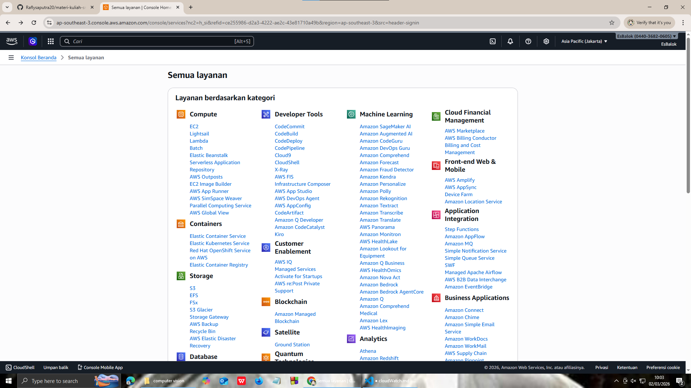
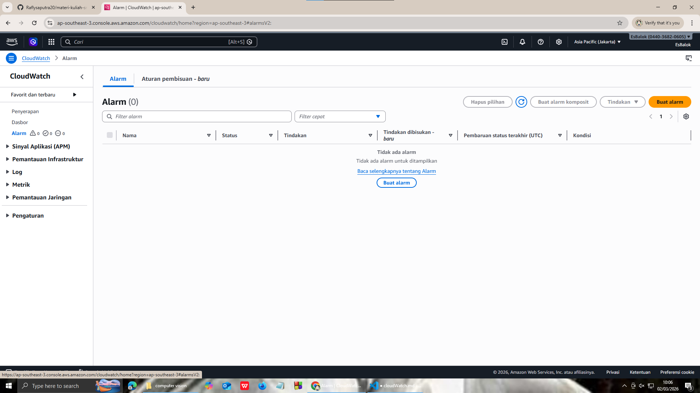
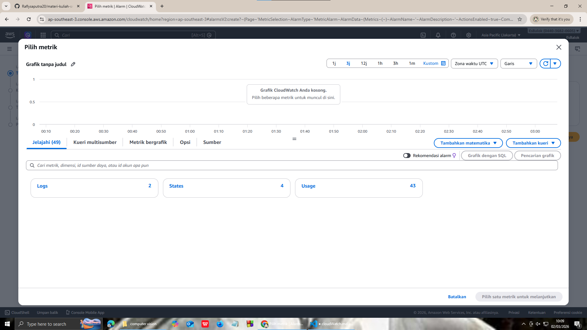

<<<<<<< HEAD
# #membuat monitiroing biling alert

1. mencari menu cloud watch

2. setelah masuk cloudwatch pilih alarm

3. pilih create alarm pilih yg ec2

=======
# #membuat monitiroing biling alert

1. mencari menu cloud watch

2. setelah masuk cloudwatch pilih alarm

3. pilih create alarm pilih yg ec2

>>>>>>> b865245fa88d7681ff4dd8a854cfea4dee19a523
