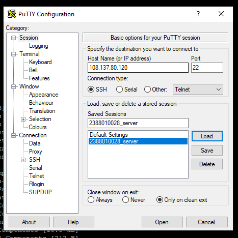
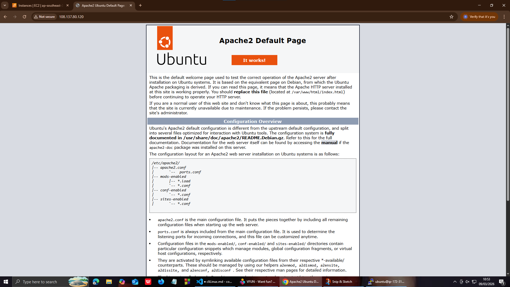
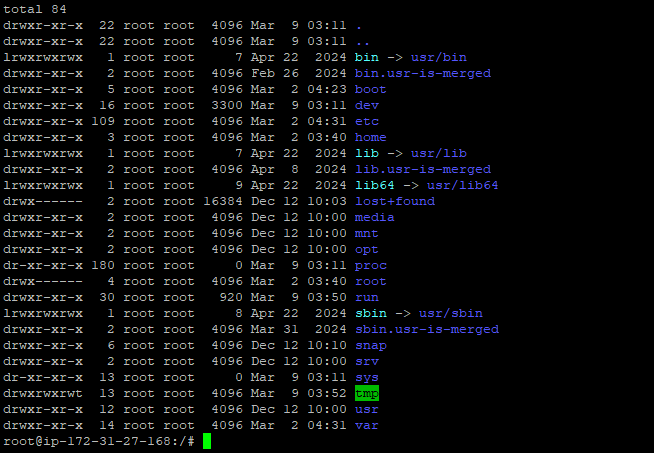
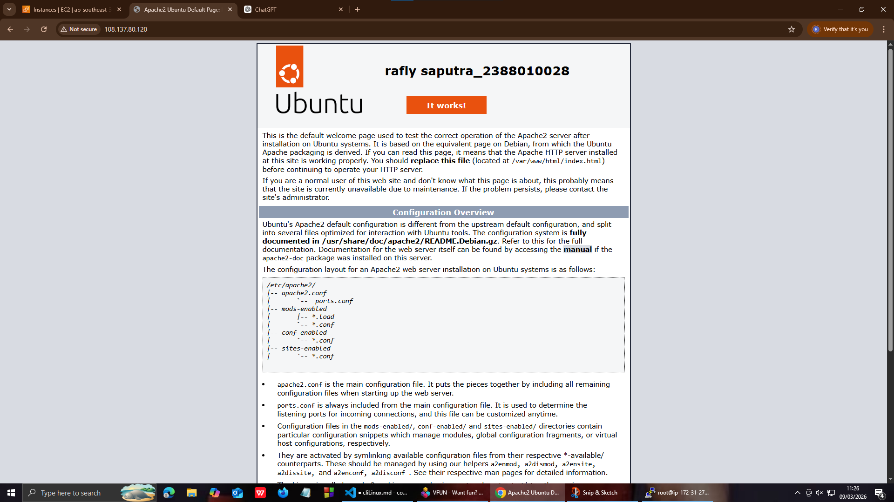

1. start instance
2. buka putty
3. kemudian load save sessiom yg disimpan pada pertemuan 2(nim_sever)
4. update bagian ipaddres v4

5. sudo apt-get upadate
6. cek web kita (systemctl status apache2)
7. sudo systemctl stop apache2 (untuk berhentikan web server)
8. sudo systemctl start apache2 (untuk start ulang web server)

   
9. masukan comend ( ls -la) untuk melihat directory tempat cursor aktif
10. masukan sudo su(untuk masuk ke home)
11. massukan cd ../.. untuk ke root folder ls -la

    
12. masuk ke folder var (cd var/cd www/ cd html)
13. nano index.html untuk custom nama dan nim
14. 
