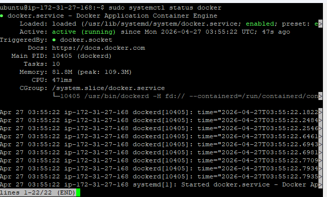
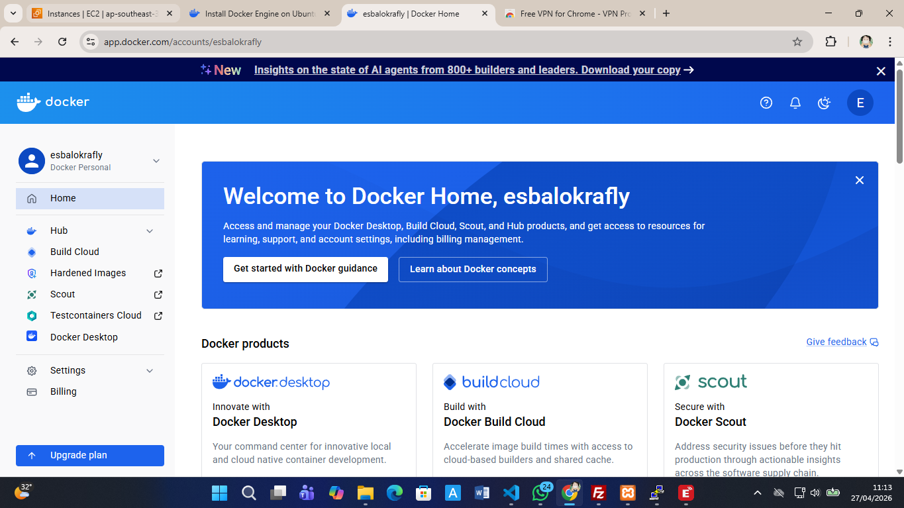
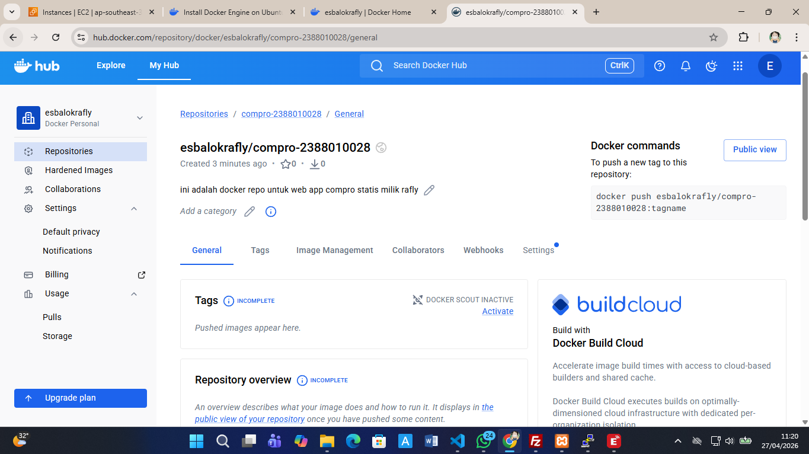
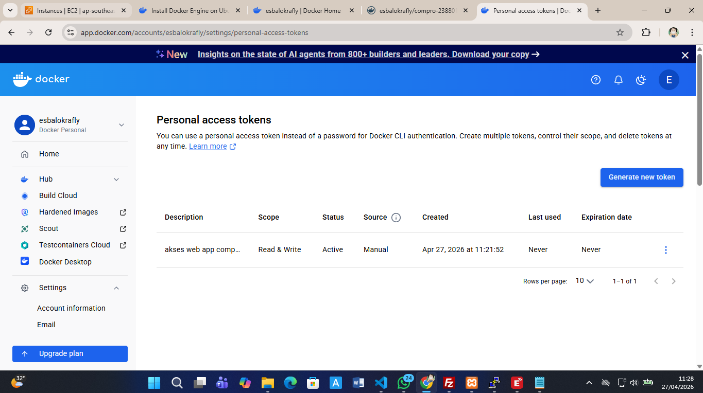
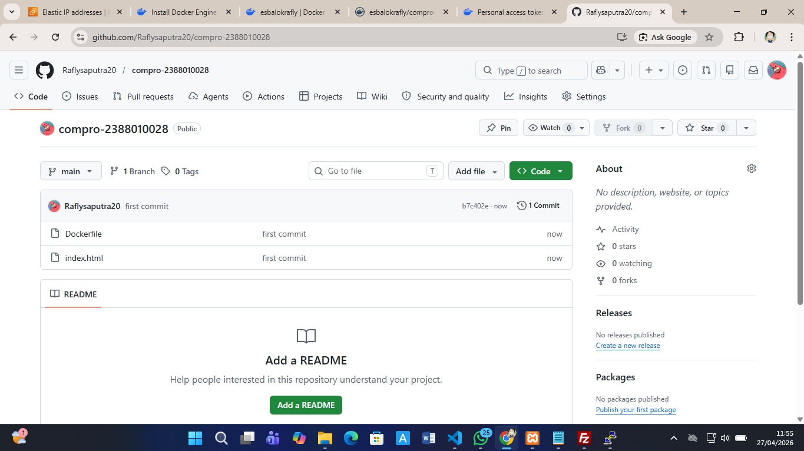

# INTRO DOCKER ENGINE IN INSTANCE EC2 AWS

1. INSTALL BASED DOCKER documentation (https://docs.docker.com/engine/install/ubuntu/)

    - unistal old version docker
    sudo apt remove $(dpkg --get-selections docker.io docker-compose docker-compose-v2 docker-doc podman-docker containerd runc | cut -f1)
    - instal docker
        1. sudo apt-get update && sudo apt-get upgrade
        2. Add Docker's official GPG key:
            sudo apt update
            sudo apt install ca-certificates curl
            sudo install -m 0755 -d /etc/apt/keyrings
            sudo curl -fsSL https://download.docker.com/linux/ubuntu/gpg -o /etc/apt/keyrings/docker.asc
            sudo chmod a+r /etc/apt/keyrings/docker.asc
        3. Add the repository to Apt sources:
            sudo tee /etc/apt/sources.list.d/docker.sources <<EOF
            Types: deb
            URIs: https://download.docker.com/linux/ubuntu
            Suites: $(. /etc/os-release && echo "${UBUNTU_CODENAME:-$VERSION_CODENAME}")
            Components: stable
            Architectures: $(dpkg --print-architecture)
            Signed-By: /etc/apt/keyrings/docker.asc
            EOF

        4. upadate os -> sudo apt update
        5. Install the Docker packages. -> sudo apt install docker-ce docker-ce-cli containerd.io docker-buildx-plugin docker-compose-plugin
        6. cek installation -> sudo systemctl status docker 

        

2. registrasi doceker hub 
    - URL SING UP -> 
    - countinue with github
    - 

3.  create repository
    - click menu -> hub -> repostiory
    - clik button new repository
    - isi nama repository = compro-nim dan deskripsi = web apps statis compro
    - visibility = public
    - create
    - 

4. create token acces
    - klik profil -> account setting => personal acces tokens
    - klik generate new tokens
    - expire date = none
    - acces permison = read/white
    - klick generate
    - 

5.  create projek di local
    - buat folder compro_nim
    - masukan file index.html compro
    - buatl file dockerfile
        FROM nginx:alpine
        COPY index.html /usr/share/nginx/html\
        EXPOSE 80

6. push github

    