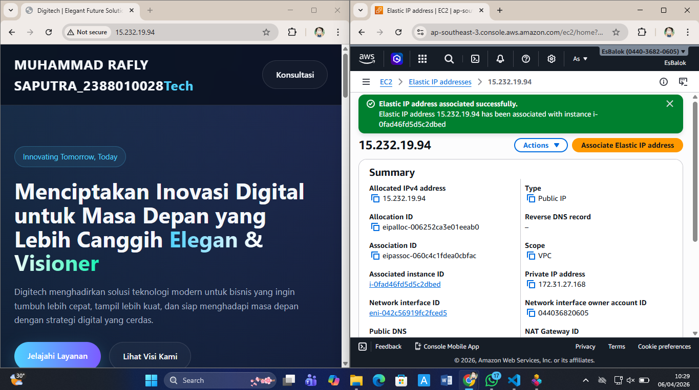

# membuat elastic ip

1. nyalakan instance ec2 yg sudah di create sebelumnya
2. ke menu networl adan securty pilih menu ELASTIC IP
    - klik menu allocate elastic ip
    - pilih amazon's pool of ipv4 addres
    - network border grup (south east asia)
    - isi tags(key-server-6B VALUE = praktukum elastic ip)
    - klik allocate
3. assosiacate kan elastic ip segera mungkin (>1 jam akan kena cost)
    - centang mana eip yg diplih
    - pilih action ->  assosiacet elastic ip
    - resource type pilih instance
    - pilih instance
    - klik assosiacate
    