A. DESKRIPSI TUGAS (THE MISSION)
Anda sedang melamar posisi Cloud Engineer di sebuah perusahaan teknologi multinasional. Sebagai ujian teknis sekaligus pembuktian skill Anda, Tim HRD dan Tim Infrastruktur memberikan tantangan:
"Deploy Curriculum Vitae (CV) atau Portofolio Pribadi Anda dalam bentuk Website Statis ke server AWS dari nol, dalam waktu kurang dari 1,5 jam."
Anda diwajibkan membangun infrastruktur servernya, mengamankannya sesuai standar industri, dan memastikan Web CV Anda dapat diakses secara global oleh tim penilai.

1. Buat vm/instance baru

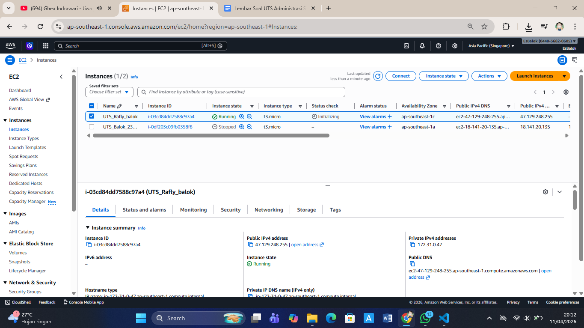

2. Set up ssh dan sftp
- set up ssh
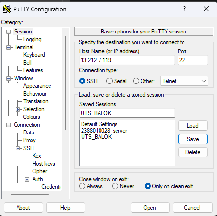
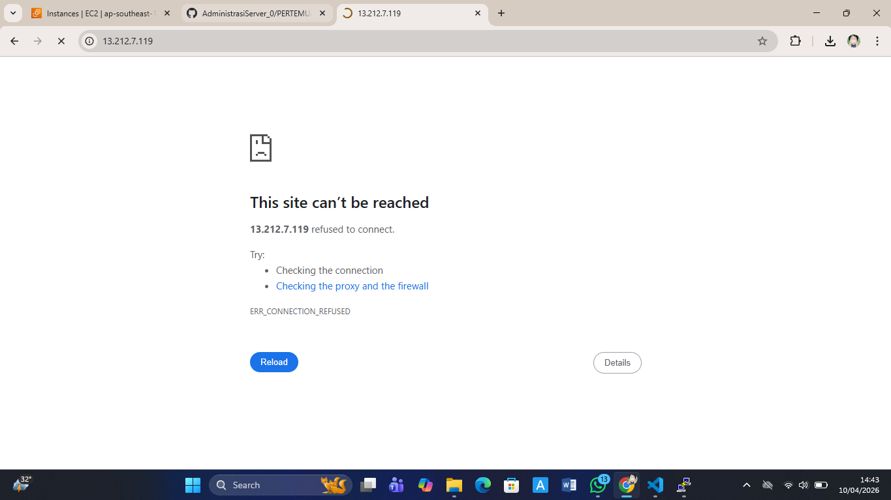
sudo apt install nginx
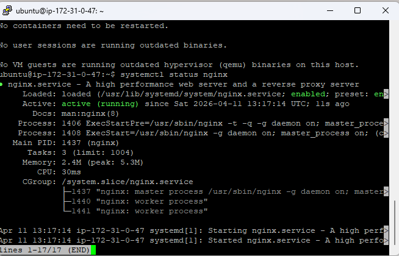
systemctl status nginx
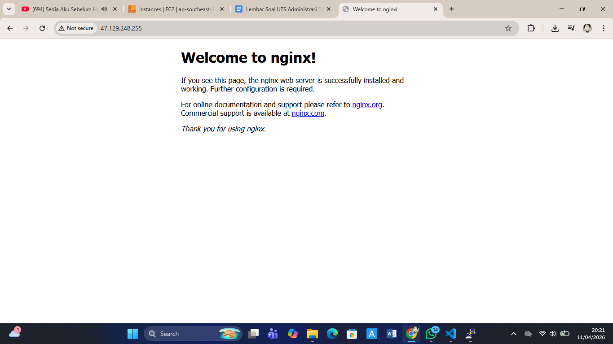

- set up sftp
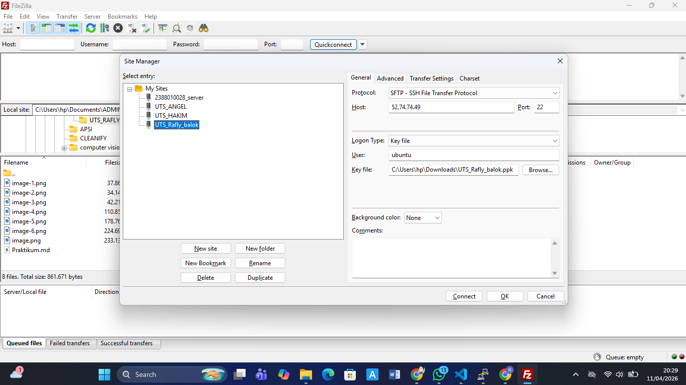
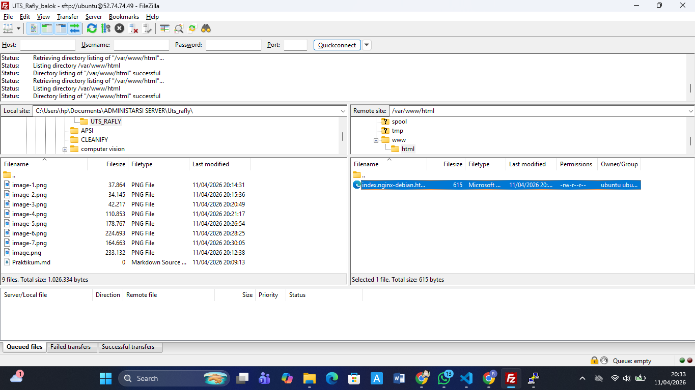

3. set up cloudWatch
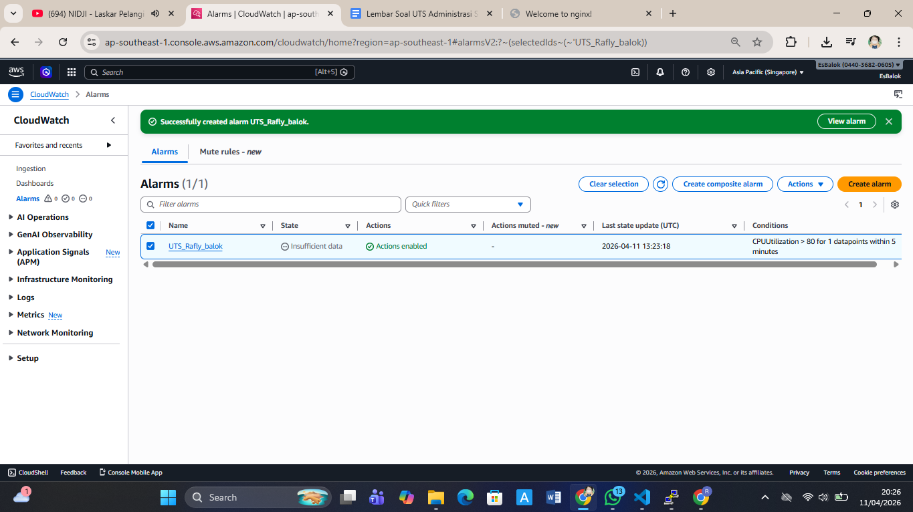

4. securty groub
   

5. set up elasticIp
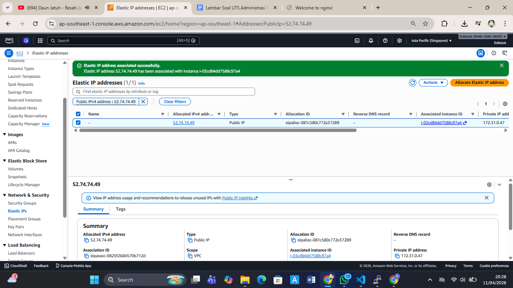

7. deployment
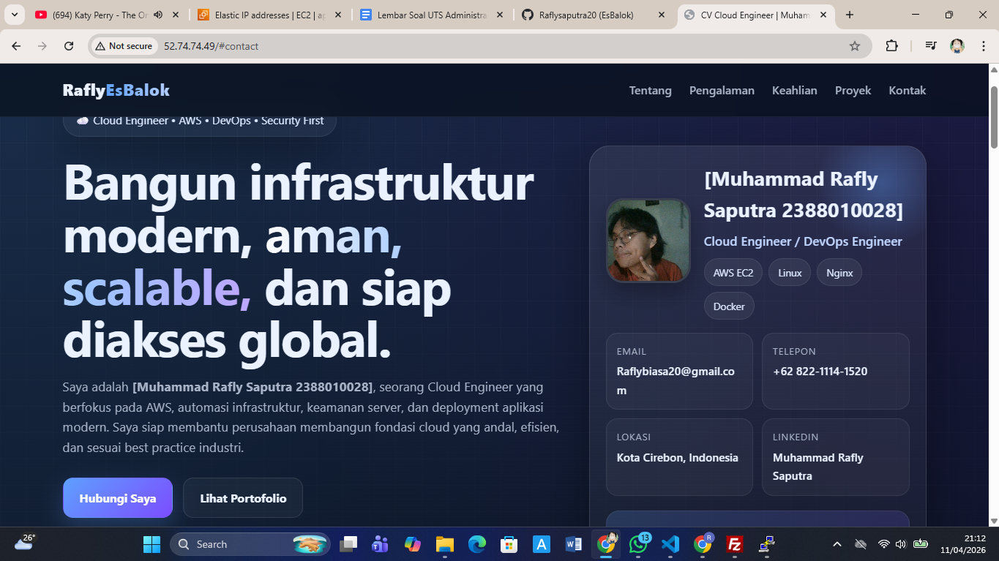
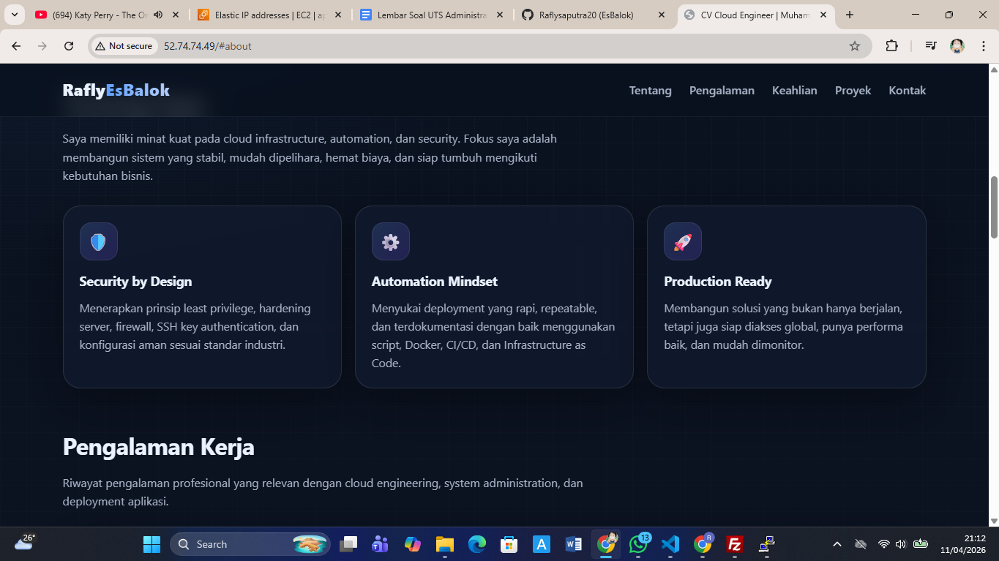
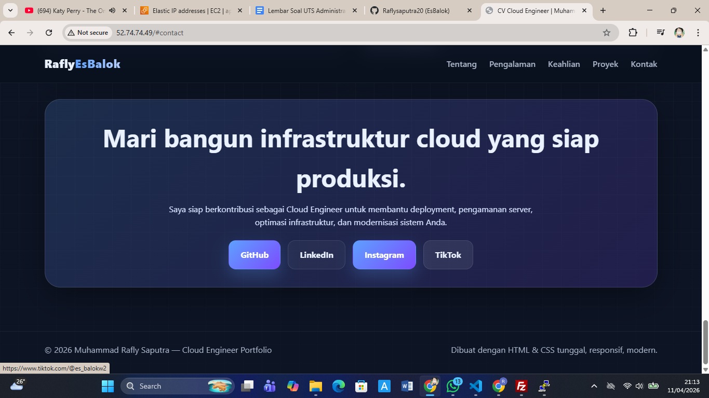
